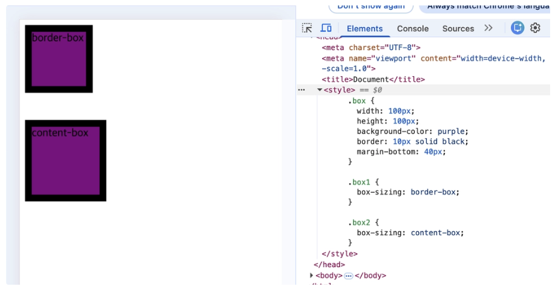
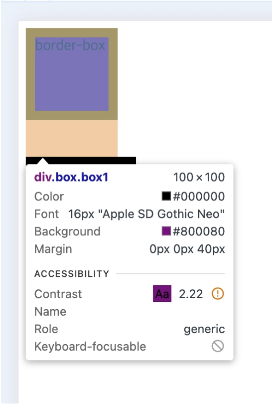
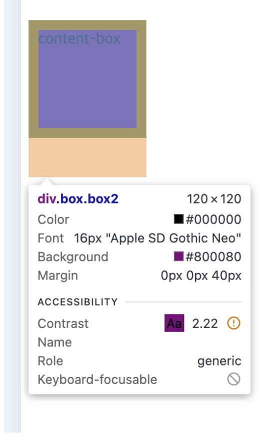
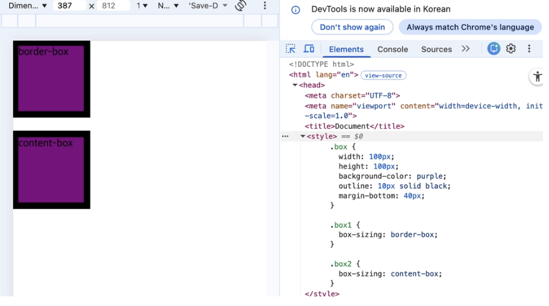
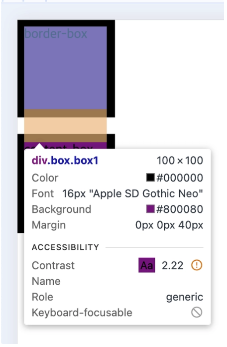
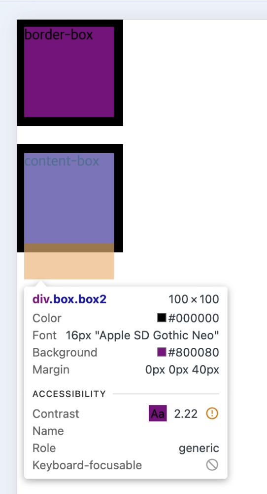

# border vs outline의 차이점 🍠 

### border vs outline

- `border` : 박스 모델에 포함되는 진짜 테두리
    - 크기 계산에 영향 있음
- `outline` : 박스 바깥에 그려지는 가짜 테두리 (강조선)
    - 크기 계산에 영향 없음

### box-sizing이란?

- `content-box` : `weight`, `height` 가 내용 크기만을 뜻함
- `border-box` : `weight`, `height` 가 내용 + padding + border까지 포함된 전체 크기를 뜻함
    - padding, border이 추가되면 지정한 weight, height 안에 넣고, content이 줄어듦

### border일 때

- border-box일 때
 
    - 테두리가 박스 내부에 추가된다.
    - 사진처럼 100px*100px에서 border: 10px를 추가하면 10px가 박스 내부에 추가되기에 박스 전체의 크기는 100px가 유지된다. = content 영역은 줄어든다.

- context-box일 때
 
    - 테두리가 박스 외부에 추가된다.
    - 사진처럼 100px*100px에서 border: 10px를 추가하면 10px가 박스 외부에 추가되기에 박스 전체의 크기는 120px가 된다.

### outline일 때
 
- border-box일 때
 
    - 테두리는 계산 대상이 아니게 된다.
    - 사진처럼 100px*100px에서 outline: 10px를 추가해도 박스 크기는 100px*100px이다 (outline은 계산하지 않기 때문에)
- content-box일 때
 
    - 테두리는 계산 대상이 아니게 된다.
    - 사진처럼 100px*100px에서 outline: 10px를 추가해도 박스 크기는 100px*100px이다 (outline은 계산하지 않기 때문에)