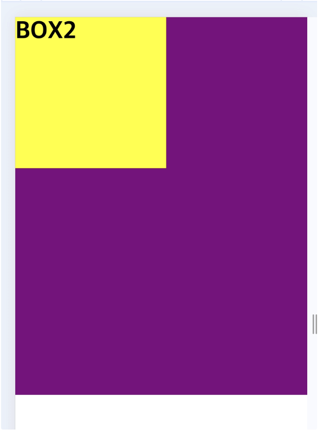

# 실습 과제:
- position: absolute를 활용해서 아래 이미지처럼 BOX2를 BOX1 안으로 이동시켜보세요!

```
<!DOCTYPE html>
<html lang="en">

<head>
  <meta charset="UTF-8">
  <meta name="viewport" content="width=device-width, initial-scale=1.0">
  <title>Document</title>
  <style>
    /** 전체 선택자 기본적으로 설정된 마진을 없앰. */
    * {
      margin: 0;
      box-sizing: border-box;
    }

    .box1 {
      width: 500px;
      height: 500px;
      background-color: purple;
      color: white;
      position: relative;
    }

    .box2 {
      width: 200px;
      height: 200px;
      background-color: yellow;
      position: absolute;
      top: 0px;
    }
  </style>
</head>

<body>
  <div class="box1">BOX1</div>
  <h1 class="box2">BOX2</h1>
</body>

</html>
```



- `absolute`는 `relative`를 기준으로 움직인다.
- `left`를 따로 지정하지 않아도 왼쪽 위에 붙는 이유는, 지정하지 않으면 `auto`로 설정되는데 이 때 `<h1>` 는 원래 자리가 왼쪽 위에서 시작하는 블록요소라서 `auto`여도 자동으로 붙게 된다.