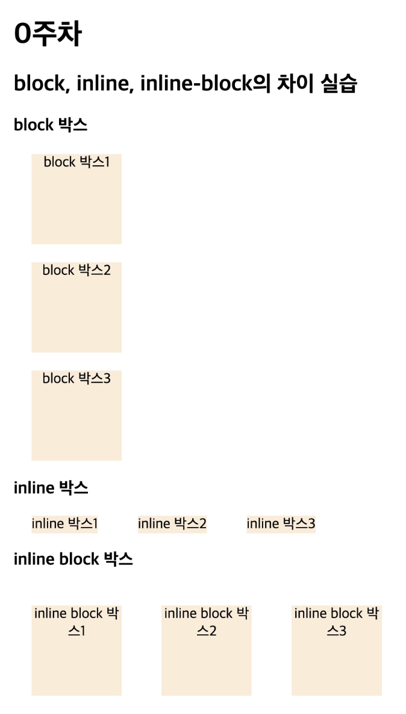

# 그러면, inline-block은 어떠한 방식으로 동작할까요? 🍠

**`block` 요소의 특징**

- `inline`과 달리 한 줄에 나열되지 않고 그 자체로 한 줄을 완전히 차지한다.
- `margin`, `width`, `height` 속성이 모두 적용된다.

**`inline` 요소의 특징**

- 줄을 바꾸지 않고 다른 요소와 한 행에 위치시킬 수 있다.
- `margin`, `width`, `height` 속성을 정의해도 적용되지 않는다.
    - 좌,우 여백은 `margin`이 적용된다.
    - 상,하 여백은 `margin` 이 아닌 `line-height` 속성에 의해 발생한다.
    - 너비, 높이는 `width`, `height` 이 아닌 내부 요소의 부피에 맞춰진다.

**`inline-block` 요소의 특징**

inline과 block의 특징을 둘 다 가진 속성

- `inline` 처럼 여러 요소를 한 줄에 위치시킬 수 있지만, `margin`, `width`, `height` 를 설정할 수 있다.

# block, inline, inline-block 직접 html과 css를 활용해서 무엇이 다른지, VS Code Live Server Extension을 활용하여, 실습 한 이미지를 첨부하여 설명해주세요. 🍠



```
<!DOCTYPE html>
<html lang="ko">
<head>
    <meta charset="UTF-8">
    <meta name="viewport" content="width=device-width, initial-scale=1.0">
    <title>block, inline, inline-block의 차이 실습</title>
    <style>
        * {
            box-sizing: border-box;
        }

        .p {
            color: gray;
        }

        .box {
            background-color: antiquewhite;
            width: 100px;
            height: 100px;
            margin: 20px;
            text-align: center;
        }

        .block {
            display: block;
        }

        .inline {
            display: inline;
        }

        .inline-block {
            display: inline-block;
        }
    </style>
</head>
<body>
    <h1>0주차</h1>
    <h2>block, inline, inline-block의 차이 실습</h2>

    <h3>block 박스</h3>
    <div class="block box">block 박스1</div>
    <div class="block box">block 박스2</div>
    <div class="block box">block 박스3</div>

    <h3>inline 박스</h3>
    <div class="inline box">inline 박스1</div>
    <div class="inline box">inline 박스2</div>
    <div class="inline box">inline 박스3</div>

    <h3>inline block 박스</h3>
    <div class="inline-block box">inline block 박스1</div>
    <div class="inline-block box">inline block 박스2</div>
    <div class="inline-block box">inline block 박스3</div>
</body>
</html>
```
- `block`
    
    줄바꿈이 일어나고 `width`, `height`, `margin` 이 잘 적용된다.
    
- `inline`
    
    줄바꿈이 일어나지 않고 `width`, `height` 는 적용되지 않으며, 좌우 `margin`은 적용되고 상하 `margin` 은 적용되지 않는다.
    
- `inline-block`
    
    줄바꿈이 일어나지 않고 `width`, `height`, `margin`이 잘 적용된다.