# css 키워드 정리

## [box-sizing-border/outline] border vs outline의 차이점 🍠

### ✔️ 상황 1: 요소 크기 변화

```html
<body>
  <h1>border-box</h1>
  <section>
    <div class="box border-box border">border</div>
    <div class="box border-box outline">outline</div>
  </section>

  <h1>content-box</h1>
  <section>
    <div class="box content-box border">border</div>
    <div class="box content-box outline">outline</div>
  </section>
</body>
```

```css
.box {
  width: 120px;
  height: 120px;
  padding: 10px;
}

.border-box {
  box-sizing: border-box;
}

.content-box {
  box-sizing: content-box;
}

.border {
  border: 10px solid green;
}

.outline {
  outline: 10px solid green;
}
```

### 👉 결과

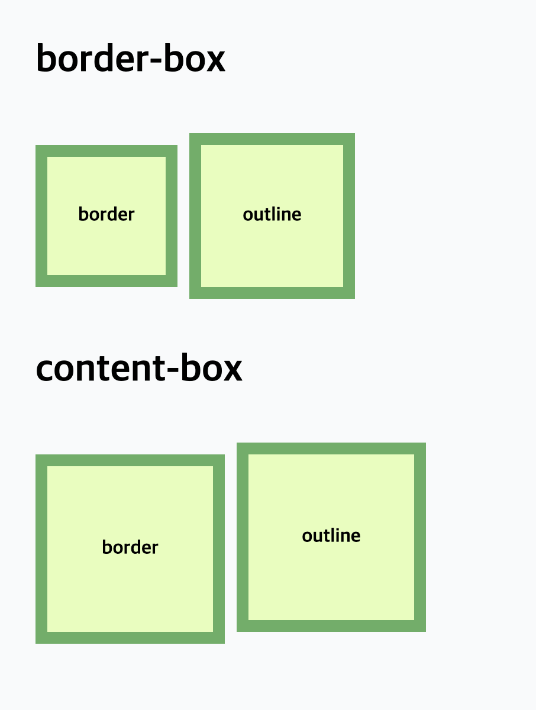

### 🔹 결과 해석

**1️⃣ border-box 영역**

> width/height 안에 padding + border까지 포함됨

✅ border

 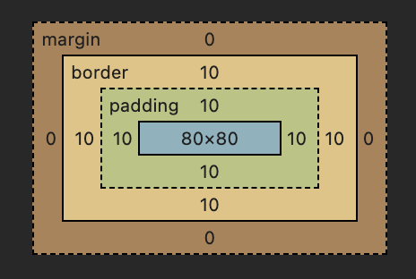

- border가 이미 120px 안에 포함되므로 박스 크기 그대로 유지
- 안쪽이 줄어듦

✅ outline

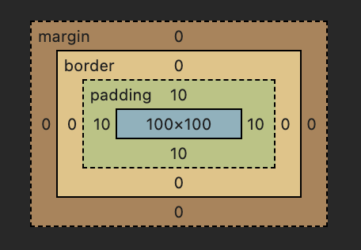

- outline은 크기에 포함 안됨
- 바깥에 그려지므로 더 커보임

---

**2️⃣ content-box 영역**

> width/height는 content만 기준이고,
> padding + border는 밖으로 늘어남

✅ border

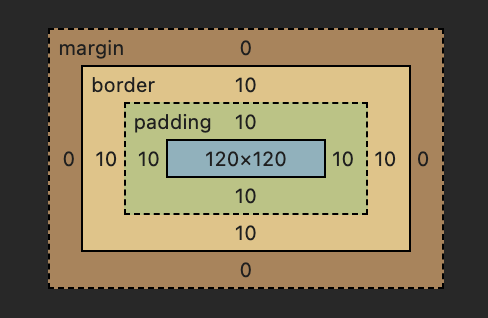

- border와 padding이 바깥으로 추가되므로 박스 크기가 커짐

✅ outline

 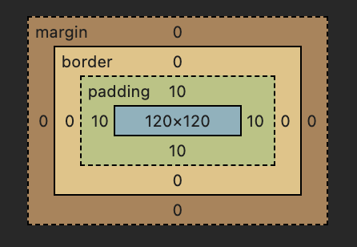

- outline은 원래부터 바깥에 그리므로 box-sizing에 영향이 없음

---

### ✔️상황 2: 요소 간 간격 (레이아웃)

```html
<body>
  <div>
    <h1>border → 요소를 밀어냄</h1>
    <section>
      <div class="box border">border</div>
      <div class="box target">기준</div>
    </section>
  </div>

  <div>
    <h1>outline → 요소에 영향 없음</h1>
    <section>
      <div class="box outline">outline</div>
      <div class="box target">기준</div>
    </section>
  </div>
</body>
```

```css
.box {
  width: 120px;
  height: 120px;
  padding: 10px;
}

.border {
  border: 10px solid green;
}

.outline {
  outline: 10px solid green;
}

.target {
  background-color: lightcoral;
}
```

### 👉 결과

## 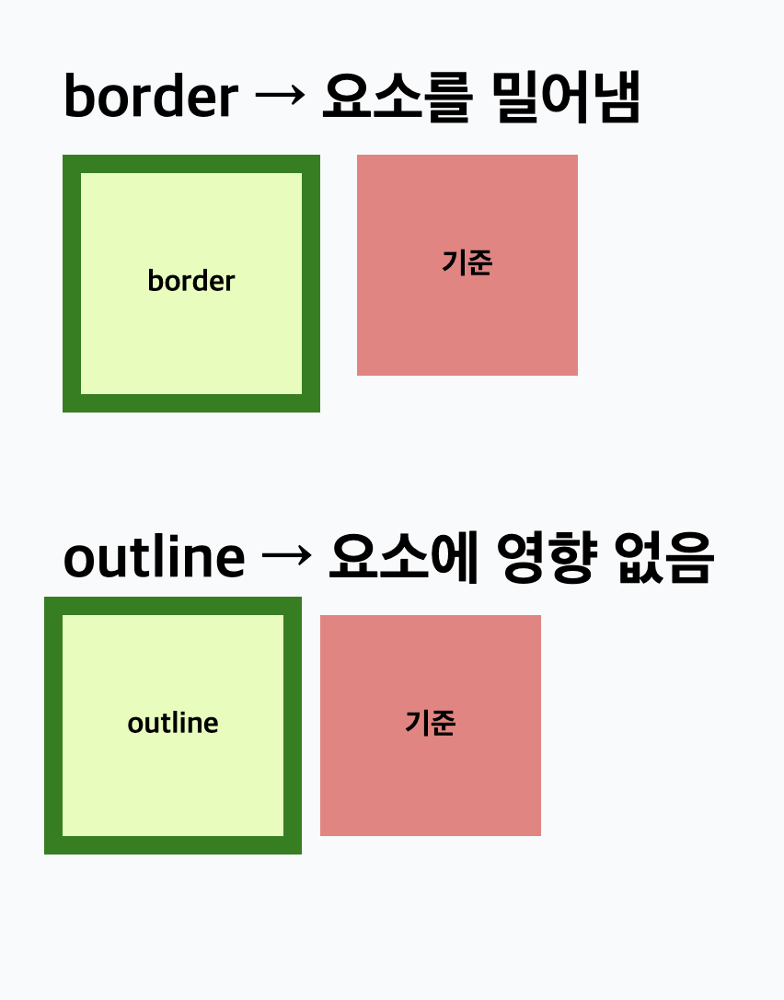

### 🔹 결과 해석

**1️⃣ border → 요소를 밀어냄**

> border는 박스 모델에 포함됨

 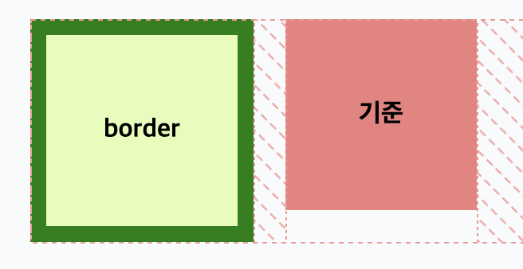

- border가 생기면 요소의 실제 크기가 커지므로
- 옆에 있는 "기준" 박스가 밀려남

---

**2️⃣ outline → 요소에 영향 없음**

> outline은 박스 모델에 포함되지 않음

 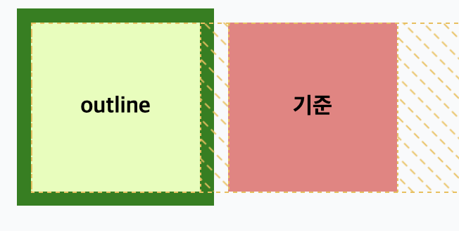

- 크기 변화가 없고 레이아웃 변화가 없으므로
- 옆 "기준" 박스가 그대로 위치를 유지함

---

### ✔️상황 3: 요소 겹침

```html
<body>
  <div>
    <h1>border → 요소를 밀어냄</h1>
    <section>
      <div class="box border">border</div>
      <div class="box target">기준</div>
    </section>
  </div>

  <div>
    <h1>outline → 요소 위에 겹쳐 보임</h1>
    <section>
      <div class="box outline">outline</div>
      <div class="box target">기준</div>
    </section>
  </div>
</body>
```

```css
.box {
  width: 120px;
  height: 120px;
  padding: 10px;
}

.border {
  border: 10px solid green;
}

.outline {
  outline: 10px solid green;
}

.target {
  background-color: lightcoral;
}
```

---

### 👉 결과

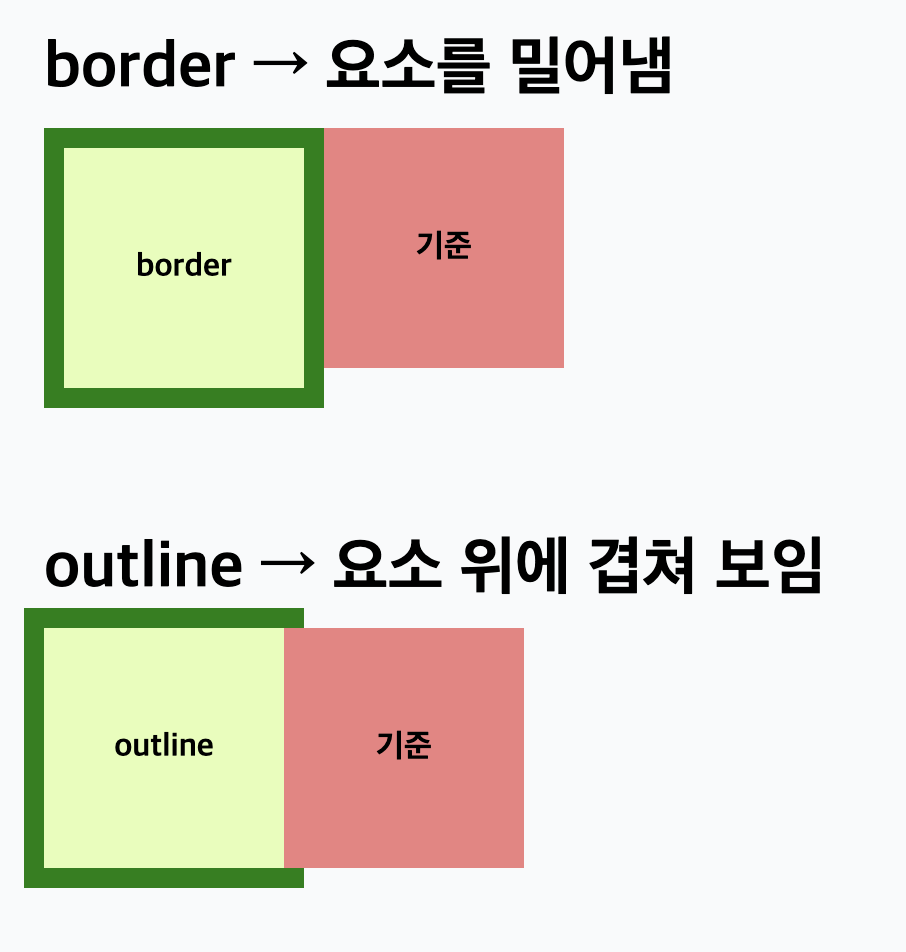

---

### 🔹 결과 해석

**1️⃣ border → 요소를 밀어냄**

> border는 박스 모델에 포함됨

 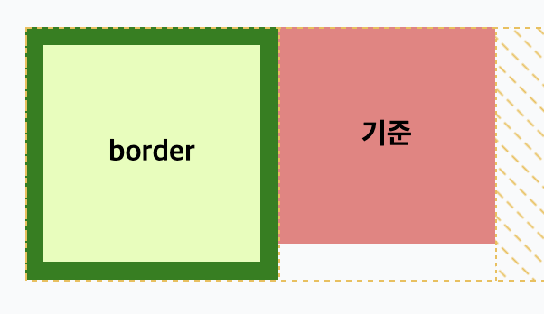

- border가 생기면 요소의 실제 크기가 커지므로
- 옆에 있는 "기준" 박스가 밀려남

---

**2️⃣ outline → 요소에 영향 없음**

> outline은 박스 모델에 포함되지 않음

 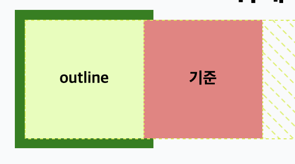

- 크기 변화가 없고 레이아웃 변화가 없으므로
- 옆 "기준" 박스가 그대로 위치를 유지하고
- outline이 그 위로 겹쳐서 보임

---

### 주요 차이 정리

| 항목           | border    | outline      |
| -------------- | --------- | ------------ |
| 위치           | 요소 내부 | 요소 외부    |
| 크기 영향      | O         | X            |
| 레이아웃 영향  | O         | X            |
| 다른 요소 영향 | 밀어냄    | 겹칠 수 있음 |
| box model 포함 | O         | X            |

---

## [반응형 background] 반응형 background 관련 키워드를 정리해보세요 🍠

### 1️⃣ background-image

👉 요소에 배경 이미지를 넣는 속성

```css
background-image: url("image.jpg");
```

- 여러 개도 가능

```css
background-image: url("a.png"), url("b.png");
```

---

### 2️⃣ background-repeat

👉 이미지 반복 여부 설정

```css
background-repeat: repeat; /* 기본값 (반복) */
background-repeat: no-repeat; /* 반복 없음 */
background-repeat: repeat-x; /* 가로 반복 */
background-repeat: repeat-y; /* 세로 반복 */
```

---

### 3️⃣ background-position

👉 이미지 위치 지정

```css
background-position: left top;
background-position: center;
background-position: right bottom;
background-position: 50% 50%;
background-position: 100px 50px;
```

- 기준: 요소 영역 기준

---

### 4️⃣ background-size

👉 배경 이미지 크기 조절

```css
background-size: auto; /* 기본값 */
background-size: cover; /* 꽉 채움 (비율 유지, 잘릴 수 있음) */
background-size: contain; /* 전체 보이기 (비율 유지, 여백 생김) */
background-size: 100px 100px;
background-size: 50% 50%;
```

---

### 5️⃣ 축약형 (background shorthand)

👉 여러 속성을 한 번에 작성

```css
background: url("image.jpg") no-repeat center / cover;
```

- 순서 : image repeat position / size

---

## [transform] transform 관련 키워드를 정리해보세요 🍠

### 1️⃣ translate (이동)

👉 요소를 X/Y 방향으로 이동

```css
transform: translateX(100px);
transform: translateY(50px);
transform: translate(100px, 50px);
transform: translate(-50%, -50%);
```

✔️ 특징

- 위치만 이동 (레이아웃 영향 X)
- 요소 자체 기준 이동

---

### 2️⃣ scale (크기)

👉 요소 크기 확대 / 축소

```css
transform: scale(1.5); /* 1.5배 */
transform: scaleX(2); /* 가로만 */
transform: scaleY(0.5); /* 세로만 */
```

✔️ 특징

- 1 = 기본
- 0.5 = 축소
- 중심 기준으로 확대됨

---

### 3️⃣ rotate (회전)

👉 요소를 특정 각도로 회전

```css
transform: rotate(45deg);
transform: rotate(-45deg);
```

✔️ 특징

- 기본 기준점 = center
- 요소를 변형 없이 회전
- 단위: deg (도)

---

### 4️⃣ skew (기울이기)

👉 요소를 비틀어 변형

```css
transform: skewX(20deg);
transform: skewY(20deg);
transform: skew(20deg, 10deg);
```

✔️ 특징

- x축 / y축 각각 기울기 가능
- 평행사변형처럼 변형됨

---

### 5️⃣ matrix (모든 변환 한 번에)

👉 transform을 한 줄로 합친 형태

```css
transform: matrix(a, b, c, d, tx, ty);
```

| 값     | 의미      |
| ------ | --------- |
| a, d   | scale     |
| b, c   | skew      |
| tx, ty | translate |

✔️ 특징

- translate, scale, skew를 모두 포함

---

## [transition] transition 관련 키워드를 정리해보세요 🍠

### 1️⃣ transition-property

👉 어떤 CSS 속성을 애니메이션 할지 지정

```css
transition-property: all; /* 모든 속성 */
transition-property: width; /* 특정 속성만 */
transition-property: background-color;
```

✔️ 특징

- 숫자 변화 가능한 속성만 가능
  | 가능 | 불가능 |
  | ------------- | -------- |
  | `width`, `height`, `color`, `transform` | `display`, `position` |

---

### 2️⃣ transition-duration

👉 애니메이션 지속 시간으로 필수 속성이기에 없으면 동작 안함

```css
transition-duration: 0.5s;
transition-duration: 300ms;
```

✔️ 단위

- s (초)
- ms (밀리초)

---

### 3️⃣ transition-timing-function

👉 애니메이션 속도의 변화 패턴

✔️ 주요 값

```css
ease        /* 기본 (느리게 시작 → 빠름 → 느리게 끝) */
linear      /* 일정 속도 */
ease-in     /* 시작 느림 */
ease-out    /* 끝 느림 */
ease-in-out /* 양쪽 느림 */
```

✔️ 특징

- linear → 직선
- ease → 곡선
- 직접 속도 곡선 설정 가능

```css
transition-timing-function: cubic-bezier(0.4, 0, 0.2, 1);
```

---

### 4️⃣ transition-delay

👉 시작 지연 시간

```css
transition-delay: 0.5s; /* 0.5초 뒤 시작 */
```

---

### 5️⃣ transition-behavior

👉 기존에 애니메이션 불가능한 속성도 허용

```css
transition-behavior: normal;
transition-behavior: allow-discrete;
```

✔️ 설명

- normal → 기본
- allow-discrete →
  display 같은 불연속 속성도 애니메이션 가능
- 아직 브라우저 지원 제한 있음

---

### 6️⃣ 축약형

```css
transition: all 0.3s ease 0s;
```

👉 순서

```css
transition: property duration timing-function delay;
```

---

## [animation] animation 관련 키워드를 정리해보세요 🍠

### 1️⃣ animation-name

👉 사용할 애니메이션 이름

```css
animation-name: move;
```

✔️ 특징

- @keyframes에서 정의한 이름과 연결됨
- 반드시 @keyframes와 함께 사용해야 동작
- 이름이 다르면 애니메이션 실행 안 됨

### 2️⃣ animation-duration

👉 애니메이션이 실행되는 총 시간 (필수)

```css
animation-duration: 1s;
```

✔️ 단위

- s (초)
- ms (밀리초)

---

### 3️⃣ animation-delay

👉 시작 지연 시간

```css
animation-delay: 0.5s;
```

✔️ 특징

- 페이지 로드 후 바로 실행되지 않고 지연됨
- 음수 값도 가능 (중간부터 시작하는 효과)

---

### 4️⃣ animation-direction

👉 애니메이션 진행 방향 설정

```css
animation-direction: normal;
animation-direction: reverse;
animation-direction: alternate;
animation-direction: alternate-reverse;
```

✔️ 주요 값

| 값                | 의미                 |
| ----------------- | -------------------- |
| normal            | 정방향 (기본)        |
| reverse           | 역방향               |
| alternate         | 정방향 → 역방향 반복 |
| alternate-reverse | 역방향 → 정방향 반복 |

---

### 5️⃣ animation-iteration-count

👉 애니메이션 반복 횟수

```css
animation-iteration-count: 3; /* 해당 횟수만큼 실행  */
animation-iteration-count: infinite; /* 무한 반복 */
```

✔️ 특징

- 로딩 애니메이션은 대부분 infinite를 사용

---

### 6️⃣ animation-play-state

👉 애니메이션 실행 상태 제어

```css
animation-play-state: running; /* 실행 중 */
animation-play-state: paused; /* 일시 정지 */
```

---

### 7️⃣ animation-timing-function

👉 애니메이션 속도 변화 패턴 (속도 곡선)

✔️ 주요 값

```css
ease        /* 기본 (느리게 시작 → 빠름 → 느리게 끝) */
linear      /* 일정 속도 */
ease-in     /* 시작 느림 */
ease-out    /* 끝 느림 */
ease-in-out /* 양쪽 느림 */
```

---

### 8️⃣ animation-fill-mode

👉 애니메이션 실행 전/후 상태 유지 여부

✔️ 주요 값

| 값        | 의미                      |
| --------- | ------------------------- |
| none      | 기본 상태 유지            |
| forwards  | 애니메이션 끝 상태 유지   |
| backwards | 시작 전에도 keyframe 적용 |
| both      | 시작 + 끝 상태 모두 유지  |

---

### 9️⃣ @keyframes

👉 애니메이션의 동작(프레임)을 정의하는 규칙

```css
@keyframes move {
  0% {
    transform: translateX(0);
  }
  100% {
    transform: translateX(100px);
  }
}
```

✔️ 설명

- animation-name과 연결되어 실제 동작을 만듦
- 0% → 시작 상태
- 100% → 끝 상태
- 중간 구간도 설정 가능

```css
@keyframes move {
  0% {
    transform: translateX(0);
  }
  50% {
    transform: translateX(50px);
  }
  100% {
    transform: translateX(100px);
  }
}
```

---

### 🔟 축약형

```css
animation: move 1s ease 0.5s infinite alternate forwards;
```

👉 순서

```
name duration timing delay iteration direction fill-mode
```

예시

```css
animation: move 1s ease 0.5s infinite alternate forwards;
```

✔️ ️의미

- move → 애니메이션 이름
- 1s → 1초 동안 실행
- ease → 부드러운 속도
- 0.5s → 0.5초 후 시작
- infinite → 무한 반복
- alternate → 왔다 갔다
- forwards → 마지막 상태 유지

---

## [CSS 방법론 BED] BEM 방법론에 대해 정리해보세요 🍠

### BEM이란?

BEM (Block Element Modifier)는
CSS 클래스 네이밍을 체계적으로 관리하기 위한 방법론이다.

### 기존 방식의 문제점

기존 방식:

```css
.card h2 {
  color: red;
}

.sidebar .card h2 {
  color: blue;
}
```

✔️ 문제점

- 어디에서 적용되는지 헷갈림
- 구조 바뀌면 CSS 깨짐
- 재사용 불가능
- selector가 점점 길어짐

👉 BEM 해결 방식

---

### 핵심 개념 (Block, Element, Modifier)

1️⃣ Block
👉 독립적으로 존재 가능한 UI 단위

```css
.card {
}
.button {
}
.nav {
}
```

```html
<div class="card"></div>
```

✔️ 특징

- 혼자서도 의미 있음
- 어디서든 재사용 가능
- 페이지 구조에 의존 X

---

2️⃣ Element
👉 Block 내부 구성 요소

```css
.card__title {
}
.card__content {
}
.card__button {
}
```

```html
<div class="card">
  <h2 class="card__title">제목</h2>
</div>
```

✔️ 특징

- Block에 종속됨
- 단독 사용하지 않음
- \_\_ 사용
- **Element 안에 Element 만들지 않음**
  `css
❌ card__header__title
`
  ✔️ 의미

- card\_\_title : “card 안에 있는 title”

---

3️⃣ Modifier

👉 상태 또는 변형

```css
.button--primary {
}
.button--disabled {
}
.card--featured {
}
```

```html
<button class="button button--primary">확인</button>
<button class="button button--disabled">취소</button>
```

✔️ 특징

- 스타일 변화 담당
- 단독 사용하지 않음
- Block / Element 둘 다 가능

---

### 전체 구조

```plain
block__element--modifier
```

예시:

```html
<div class="card card--highlight">
  <h2 class="card__title">제목</h2>
  <p class="card__content">내용</p>
  <button class="card__button card__button--active">버튼</button>
</div>
```
