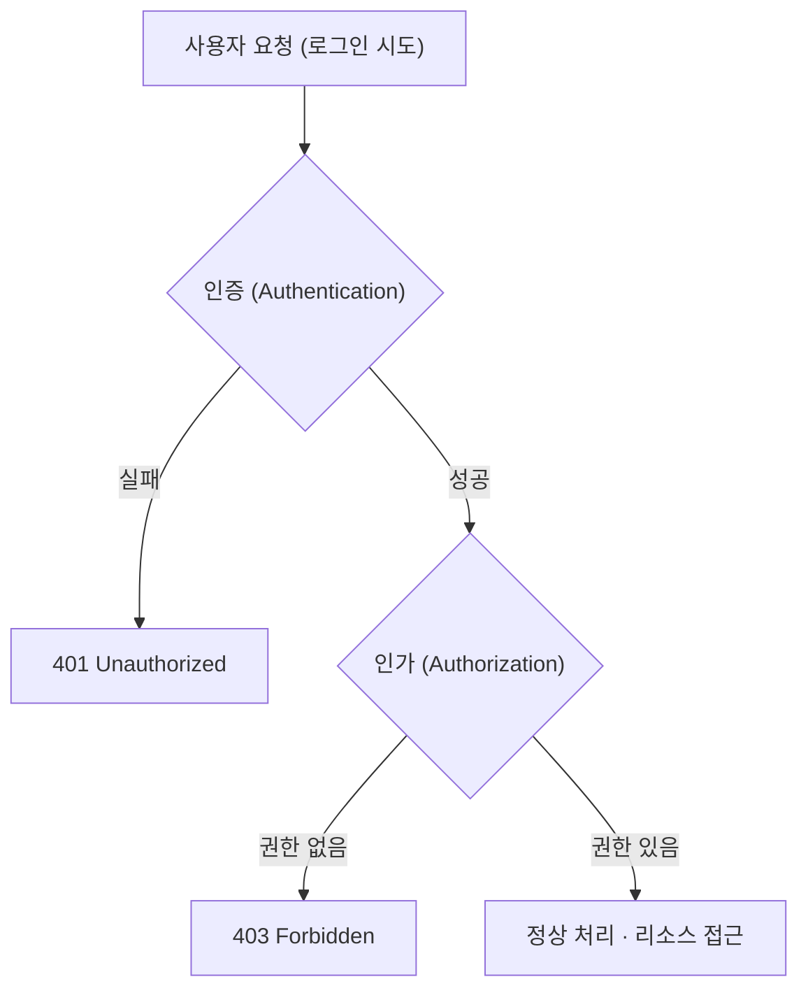

# 인증(Authentication)과 인가(Authorization)

## 두 용어의 차이

- <strong>인증(Authentication)</strong>과 <strong>인가(Authorization)</strong>는 비슷해 보이나 역할이 다름
- <strong>인증</strong>은 <strong>누구인지 확인</strong>하는 과정임
- <strong>인가</strong>는 <strong>무엇을 할 수 있는지 결정</strong>하는 과정임
- 일반적으로 <strong>인증 → 인가</strong> 순서로 흐름이 이어짐

---

## 인증(Authentication)

### 인증이란

- <strong>인증</strong>은 <strong>사용자의 신원이 주장과 일치하는지 확인</strong>하는 절차임
- 웹 서비스에 접속한 사람이 실제로 그 계정의 소유자인지 검증하는 단계에 해당함
- 이 과정이 없으면 타인이 관리자를 사칭하거나 계정을 도용할 수 있음

### 인증 방법의 예시

1. <strong>아이디와 비밀번호</strong>  
   사용자가 입력한 자격 증명이 서버·DB에 저장된 값과 일치하는지 확인함

2. <strong>소셜 로그인(OAuth 2.0)</strong>  
   <a href="https://datatracker.ietf.org/doc/html/rfc6749">RFC 6749</a>에 정의된 위임·토큰 발급 흐름을 쓰는 방식임. 외부 인가 서버가 사용자 동의 하에 클라이언트에 액세스 토큰 등을 넘김

3. <strong>다단계 인증(MFA)</strong>  
   비밀번호 외 OTP·기기 등 추가 요소로 신원을 재확인함

4. <strong>생체 인증</strong>  
   지문·얼굴 인식 등 기기·플랫폼 API 수준에서 신원을 확인함

### 프론트엔드에서의 위치

- React 등 클라이언트에서는 <strong>로그인 UI</strong>를 통해 자격 증명을 수집하고 서버에 전달함
- 서버가 검증에 성공하면 <strong>세션 식별자</strong> 또는 <strong>토큰(JWT 등)</strong> 같은 <strong>인증 증표</strong>를 발급하는 경우가 많음
- 이후 요청에서 그 증표를 통해 <strong>이미 인증된 사용자</strong>임을 입증함

---

## 인가(Authorization)

### 인가란

- <strong>인가</strong>는 인증 이후 <strong>해당 주체가 특정 리소스·기능에 접근할 권한이 있는지 판단</strong>하는 과정임
- 인증이 <strong>신원 확인</strong>이라면, 인가는 <strong>역할·정책에 따른 허용 범위 결정</strong>에 가깝음

### 인가 방식의 예시

1. <strong>역할 기반(RBAC)</strong>  
   역할 단위로 허용 동작을 구분함

2. <strong>속성 기반(ABAC)</strong>  
   속성에 따라 접근을 제한함

3. <strong>정책 기반</strong>  
   시간·위치·기기 등 조건을 조합해 접근을 제어함

### 프론트엔드에서의 위치

- <strong>라우트 가드</strong>나 <strong>조건부 렌더링</strong>으로 권한 없는 페이지 접근을 막거나 안내 화면을 보여줄 수 있음
- 최종 판단은 <strong>항상 서버</strong>에서 수행해야 하며, 클라이언트 제어는 UX·노출 최소화용으로만 사용함

---

## 인증과 인가 비교

| 구분 | 인증(Authentication) | 인가(Authorization) |
| --- | --- | --- |
| 질문 | 누구인가 | 무엇을 할 수 있는가 |
| 순서 | 먼저 수행 | 인증 이후 수행 |
| 목적 | 신원 확인 | 접근·기능 허용 여부 결정 |
| 실패 시(HTTP, 관례) | <code>401 Unauthorized</code> | <code>403 Forbidden</code> |
| 예시 | 로그인 폼에서 자격 증명 검증 | 관리자 전용 API·페이지 접근 검사 |

HTTP 상태 코드 의미는 <a href="https://www.rfc-editor.org/rfc/rfc9110.html">RFC 9110</a> 및 아래 MDN 문서와 함께 보면 됨

---

## 흐름 도식

---

## 참고 자료

- <a href="https://developer.mozilla.org/ko/docs/Web/HTTP/Reference/Status/401">MDN — 401 Unauthorized</a>
- <a href="https://developer.mozilla.org/ko/docs/Web/HTTP/Reference/Status/403">MDN — 403 Forbidden</a>
- <a href="https://developer.mozilla.org/ko/docs/Web/HTTP/Reference/Status">MDN — HTTP 응답 상태 코드</a>
- <a href="https://www.rfc-editor.org/rfc/rfc9110.html">RFC 9110 — HTTP Semantics</a>
- <a href="https://datatracker.ietf.org/doc/html/rfc6749">RFC 6749 — OAuth 2.0</a>
