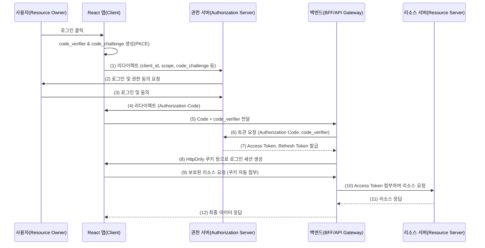
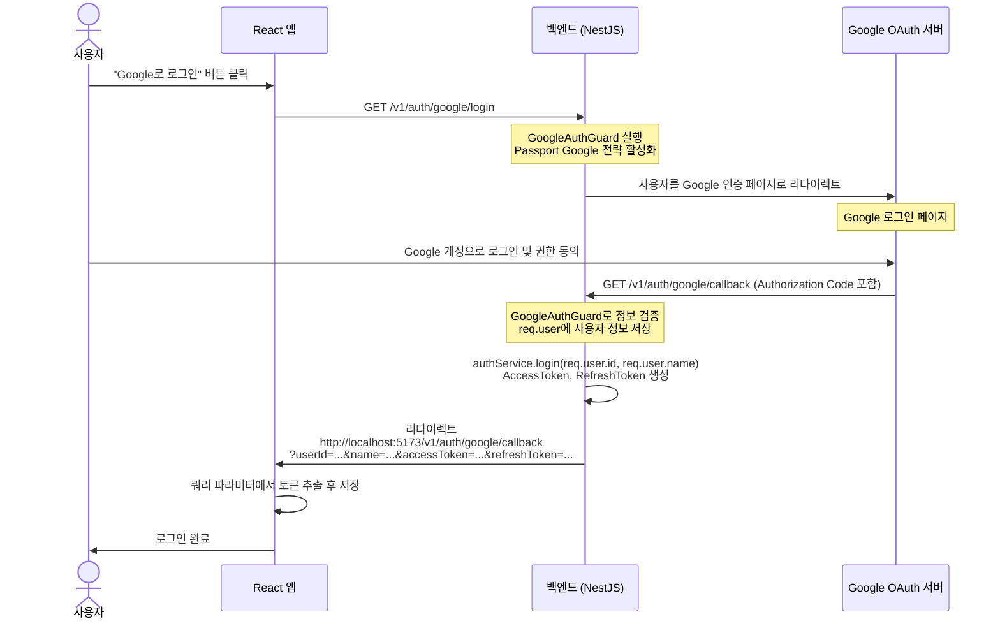
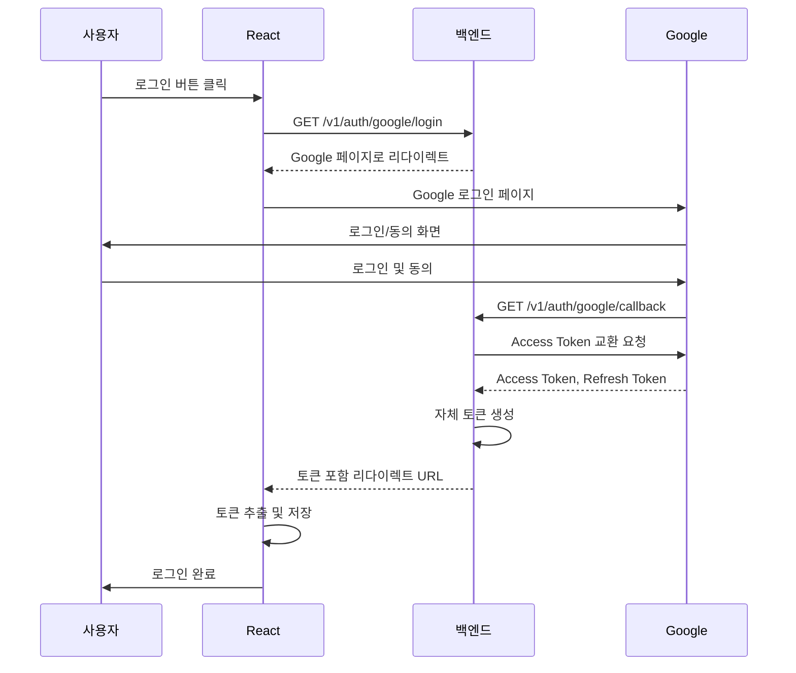

# OAuth 2.0

## 왜 나누어 보나

- 로그인이라고 부르는 **인증(Authentication)** 과 **권한 부여(Authorization)** 는 목적이 다른 개념임
- **OAuth 2.0**은 사용자가 자신의 비밀번호를 제3의 서비스에 넘기지 않으면서도, 그 서비스가 다른 서버의 자원에 접근할 수 있도록 **권한을 위임**하는 표준 프레임워크임
- "구글로 로그인" 버튼이 동작하는 방식이 대표적인 예시임 — 우리 앱은 구글 비밀번호를 전혀 모르지만, 구글이 발급한 Access Token으로 사용자 프로필에 접근할 수 있음

공식: [RFC 6749 — The OAuth 2.0 Authorization Framework](https://datatracker.ietf.org/doc/html/rfc6749)

---

## 주요 역할자 (Roles)

OAuth 2.0 흐름에는 네 가지 역할자가 있음(RFC 6749 Section 1.1).

| 역할 | 설명 | 예시 |
| --- | --- | --- |
| **리소스 소유자** (Resource Owner) | 보호된 자원의 주인, 즉 사용자 | 카카오 계정 소유자 |
| **클라이언트** (Client) | 리소스 소유자 대신 자원을 요청하는 우리 앱 | 우리가 만드는 React 웹 앱 |
| **권한 서버** (Authorization Server) | 사용자 신원을 확인하고 Access Token을 발급하는 서버 | 구글 OAuth 2.0 서버 |
| **리소스 서버** (Resource Server) | 보호된 자원을 실제로 보유한 서버. Access Token을 검증하여 데이터를 제공 | 구글 People API 서버 |

> 권한 서버와 리소스 서버는 같은 조직이 운영하는 경우가 많지만, 규격상 별개의 역할로 정의됨 (RFC 6749 Section 1.1)

---

## 기본 인가 흐름

Authorization Code Flow는 OAuth 2.0의 가장 기본적인 흐름임(RFC 6749 Section 4.1).

1. **권한 요청** — 사용자가 "구글로 로그인"을 클릭하면, 클라이언트가 사용자 브라우저를 권한 서버로 리디렉션함. `client_id`, `redirect_uri`, `scope`, `state` 등을 쿼리 파라미터로 포함함
2. **사용자 인증 및 동의** — 권한 서버의 로그인 페이지에서 사용자가 직접 인증하고, 클라이언트에 어떤 권한을 허용할지 동의함
3. **Authorization Code 발급** — 동의가 완료되면 권한 서버가 `redirect_uri`로 사용자를 리디렉션하며 일회용 **Authorization Code**를 전달함
4. **Access Token 교환** — 클라이언트 서버는 Authorization Code, `client_id`, `client_secret`을 권한 서버에 전송하고 **Access Token**(및 선택적으로 Refresh Token)을 발급받음
5. **리소스 접근** — 발급받은 Access Token으로 리소스 서버에 요청하여 사용자 데이터를 가져옴

> Authorization Code를 중간에 거치는 이유는, Access Token이 브라우저 URL에 직접 노출되지 않도록 보안을 강화하기 위해서임 (RFC 6749 Section 4.1)

---

## Authorization Code Flow with PKCE

### PKCE란 (RFC 7636)

과거 프론트엔드에서 쓰이던 **Implicit Flow**는 Access Token이 URL에 직접 노출되는 보안 문제로 인해 현재 **사용이 권장되지 않음**.

React 앱과 같은 공개 클라이언트(Public Client)는 `client_secret`을 안전하게 보관할 수 없기 때문에, **PKCE(Proof Key for Code Exchange)** 를 사용하여 Authorization Code 가로채기 공격을 방어함.

공식: [RFC 7636 — Proof Key for Code Exchange by OAuth Public Clients](https://datatracker.ietf.org/doc/html/rfc7636)

### 흐름 요약

1. **PKCE 준비** — React 앱이 랜덤 문자열 `code_verifier`를 생성하고, 이를 SHA-256으로 해시한 `code_challenge`를 만듦
2. **권한 요청** — `client_id`, `redirect_uri`, `scope`와 함께 `code_challenge`, `code_challenge_method=S256`을 권한 서버로 전송함
3. **Authorization Code 발급** — 로그인·동의 완료 후 권한 서버가 `redirect_uri`로 Authorization Code를 전달함
4. **토큰 교환 (백엔드 담당)**
    - React 앱(프론트엔드)은 Authorization Code를 직접 Access Token으로 교환하지 않음
    - 프론트엔드는 Authorization Code와 `code_verifier`를 백엔드 서버(BFF/API Gateway)에 전달함
    - 백엔드가 권한 서버에 Code + `code_verifier`를 보내면, 권한 서버는 `code_verifier`를 검증 후 Access Token을 발급함
5. **리소스 접근** — 백엔드가 Access Token으로 리소스 서버에 접근하고 데이터를 프론트엔드에 응답함

---

## 실제 구현 예시 — NestJS + Google OAuth

이론적인 흐름을 NestJS 백엔드와 React 프론트엔드 조합으로 구현할 때 어떻게 동작하는지 정리함.

### 역할 분담

| 단계 | 담당 | 설명 |
| --- | --- | --- |
| 로그인 버튼 클릭 | React | 백엔드의 `/v1/auth/google/login`으로 이동 |
| Google 인증 페이지 리다이렉트 | NestJS (GoogleAuthGuard) | Passport Google 전략을 통해 사용자를 Google 로그인 페이지로 리다이렉트 |
| 로그인 및 동의 | 사용자 | Google 계정으로 로그인 후 앱에 권한 부여 |
| Authorization Code 수신 | NestJS (`/v1/auth/google/callback`) | Google이 보낸 인증 코드를 검증하고 사용자 정보를 `req.user`에 저장 |
| 자체 토큰 발급 | NestJS (authService) | `authService.login()`으로 서비스 고유의 AccessToken·RefreshToken 생성 |
| 토큰 전달 | NestJS → React | 토큰을 쿼리 파라미터에 담아 프론트엔드 콜백 URL로 리다이렉트 |
| 토큰 추출·저장 | React | URL에서 토큰을 파싱하여 로컬 스토리지 또는 상태 관리 도구에 저장 |

### Web에서의 Google OAuth 로그인 흐름 (단계별)

1. **로그인 버튼 클릭** — 사용자가 React 앱에서 "Google 로그인" 버튼을 클릭함
2. **로그인 요청** — React 앱이 백엔드의 `/v1/auth/google/login` 엔드포인트로 이동하여 Google 인증 과정을 시작함
3. **Google 로그인 페이지로 이동** — 백엔드가 GoogleAuthGuard를 통해 사용자를 Google 로그인 페이지로 리다이렉트함
4. **Google 로그인 및 동의** — 사용자가 Google 계정으로 로그인하고 앱에 필요한 권한을 부여함
5. **콜백 및 토큰 수신** — Google이 백엔드의 `/v1/auth/google/callback`으로 Authorization Code를 전달하고, 백엔드가 이를 처리하여 AccessToken·RefreshToken을 포함한 URL로 React 앱에 리다이렉트함
6. **토큰 저장 및 로그인 완료** — React 앱이 URL에서 토큰과 사용자 정보를 추출하여 저장하고, 로그인 상태로 앱을 이용할 수 있게 됨

> 위 예시에서 토큰을 쿼리 파라미터로 전달하는 방식은 구현이 간단하지만, URL이 브라우저 히스토리·서버 로그에 노출될 수 있음. 프로덕션에서는 HttpOnly 쿠키로 토큰을 전달하거나 단명(短命) 코드를 사용하는 방식이 보안 측면에서 더 권장됨 ([RFC 9700 Section 4.2](https://datatracker.ietf.org/doc/html/rfc9700#section-4.2))

---

## 주요 토큰 종류

### Access Token (RFC 6749 Section 1.4)

- 리소스 서버에 보호된 자원을 요청할 때 사용하는 자격증명임
- 수명이 짧은 것이 권장됨 (수 분 ~ 수십 분)
- HTTP 요청 시 `Authorization: Bearer <token>` 형태로 전달하는 것이 일반적임

Bearer Token 용법: [RFC 6750 — OAuth 2.0 Bearer Token Usage](https://datatracker.ietf.org/doc/html/rfc6750)

### Refresh Token (RFC 6749 Section 1.5)

- Access Token이 만료되었을 때 새 Access Token을 발급받기 위해 권한 서버에 보내는 토큰임
- 수명이 길어 안전한 저장이 필요함 — 프론트엔드 코드가 직접 보관하지 않도록 백엔드(HttpOnly 쿠키 등)에서 관리하는 것이 권장됨
- Refresh Token 탈취를 방지하기 위해 **Refresh Token Rotation**(사용 시마다 새 Refresh Token 발급)을 적용하는 것이 권장됨 ([OAuth 2.0 Security Best Current Practice Section 4.13](https://datatracker.ietf.org/doc/html/rfc9700#section-4.13))

---

## Scope (RFC 6749 Section 3.3)

- 클라이언트가 요청하는 **접근 범위**를 공백 구분 문자열로 표현함
- 권한 서버는 요청된 Scope 내에서만 권한을 부여할 수 있으며, 사용자가 동의한 범위만 허용됨
- 예시: `scope=openid profile email`

> 최소 권한 원칙에 따라 필요한 Scope만 최소한으로 요청하는 것이 권장됨

---

## OAuth 2.0과 OpenID Connect (OIDC)

### 차이점

**OAuth 2.0**은 "이 앱이 내 데이터에 접근해도 돼"라는 **권한 부여(Authorization)** 를 다루는 프로토콜임. "이 사용자가 누구인지"를 증명하는 **인증(Authentication)** 은 OAuth 2.0 범위 밖임.

그 위에 인증 레이어를 더한 것이 **OpenID Connect(OIDC)** 임.

| 프로토콜 | 목적 | 발급 토큰 |
| --- | --- | --- |
| **OAuth 2.0** | 권한 부여 (Authorization) | Access Token, Refresh Token |
| **OpenID Connect** | 사용자 인증 (Authentication) + 권한 부여 | Access Token + **ID Token (JWT)** |

### ID Token (OIDC Core Section 2)

- OIDC는 Access Token 외에 **ID Token**을 추가로 발급함
- ID Token은 **JWT 형식**이며, 사용자의 신원 정보(`sub`, `name`, `email` 등)를 클레임으로 포함함
- 클라이언트는 ID Token의 서명을 검증하여 사용자 신원을 확인할 수 있음

공식: [OpenID Connect Core 1.0](https://openid.net/specs/openid-connect-core-1_0.html)

> "구글 로그인"을 구현할 때 실제로는 OAuth 2.0이 아니라 OpenID Connect를 사용하는 경우가 대부분임. `scope=openid`를 포함하면 ID Token도 함께 발급됨

---

## 장점

- 사용자가 비밀번호를 클라이언트 앱에 직접 전달하지 않아도 됨 — 보안 측면에서 가장 큰 이점임
- 구글, 카카오, 네이버 등 이미 신뢰받는 서비스의 인증 인프라를 그대로 활용할 수 있음
- Scope로 접근 범위를 세밀하게 제어할 수 있어, 필요한 데이터만 최소한으로 요청할 수 있음
- 사용자는 새로운 계정을 만들 필요가 없어 가입 허들이 낮아짐

---

## 단점과 주의사항

1. **구현 복잡도** — 흐름이 여러 단계에 걸쳐 있어 초기 구현 시 진입 장벽이 있음
2. **외부 의존성** — 권한 서버(구글, 카카오 등)가 장애 나면 우리 서비스 로그인도 함께 영향을 받음
3. **보안 취약점 위험** — 잘못 구현하면 오히려 CSRF, Token 탈취 등의 보안 취약점이 생길 수 있음. `state` 파라미터 검증 필수 ([RFC 6749 Section 10.12](https://datatracker.ietf.org/doc/html/rfc6749#section-10.12))
4. **인증과 혼동** — OAuth 2.0 자체는 인증 프로토콜이 아님. 신원 확인이 필요하면 OpenID Connect를 별도로 이해해야 함

---

## 참고 자료

- [RFC 6749 — The OAuth 2.0 Authorization Framework](https://datatracker.ietf.org/doc/html/rfc6749)
- [RFC 6750 — OAuth 2.0 Bearer Token Usage](https://datatracker.ietf.org/doc/html/rfc6750)
- [RFC 7636 — Proof Key for Code Exchange (PKCE)](https://datatracker.ietf.org/doc/html/rfc7636)
- [RFC 9700 — OAuth 2.0 Security Best Current Practice](https://datatracker.ietf.org/doc/html/rfc9700)
- [OpenID Connect Core 1.0](https://openid.net/specs/openid-connect-core-1_0.html)
- [MDN — OAuth](https://developer.mozilla.org/ko/docs/Web/Security/Practical_implementation_guides/OAuth_2_0)
